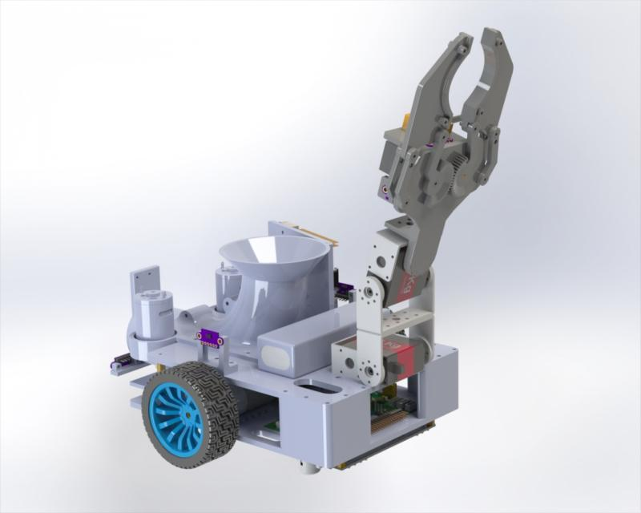
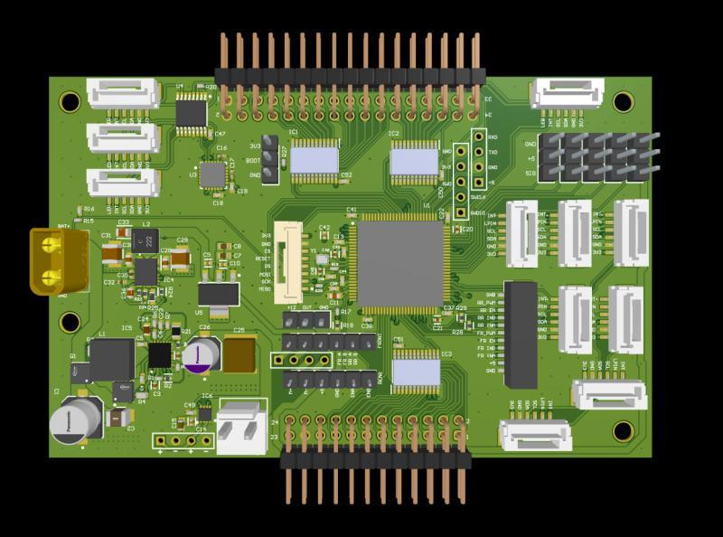
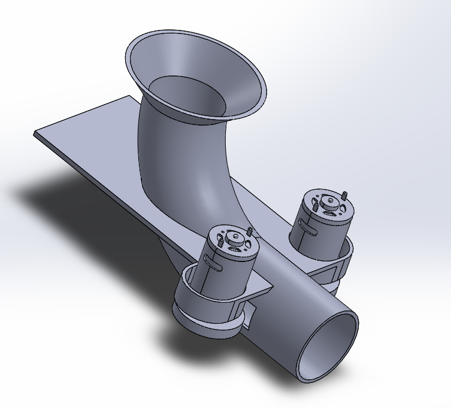

# TechBots-Bot-Working

### Introduction

Our robot was designed to compete in the **Sri Lankan Robotics Challenge 2024**. The robot utilizes a **Raspberry Pi 4B** for color detection and alignment, while the main control logic is handled by an **STM32 microcontroller**. The project combines various hardware and software components to achieve precise control and functionality.

The repository contains the codes used for the microcontroller, the Raspberry Pi, schematics, PCB Design, and 3D enclosure design.

The robot is capable of the following tasks:
* Line detection and following
* Wall color detection
* Floor color detection
* Object detection between a cube and a cylinder
* Shooting a ball into a target

The robot is entirely autonomous.

### Codes

The code for the microcontroller is found under the **STM32 Firmware** directory. There are two versions: one using an **STM32 microcontroller** and the other using an **ESP32**. These codes handle sensor readings and control the robot's movement by controlling the motors.

The **Raspberry Pi Firmware** directory contains the code for color detection and aligning the robot with its target.

### PCB Design

The schematics and PCB design files are found under the **PCB Design** directory. This includes schematics for subcircuits. The robot's PCB is a **4-layer design**.

### Shooter Mechanism

The shooter mechanism is responsible for launching balls into the target. The design, along with related control code, is provided in the **Shooter Mechanism** folder.

### 3D Models

The **3D Models** and renders of the robot are located in the **3D Designs** directory. The full assembly of the robot is also included.

### Images

Add your images to the appropriate sections below:

1. Robot Design:
   
   

2. PCB Design:

   

3. Shooter Mechanism:

   
